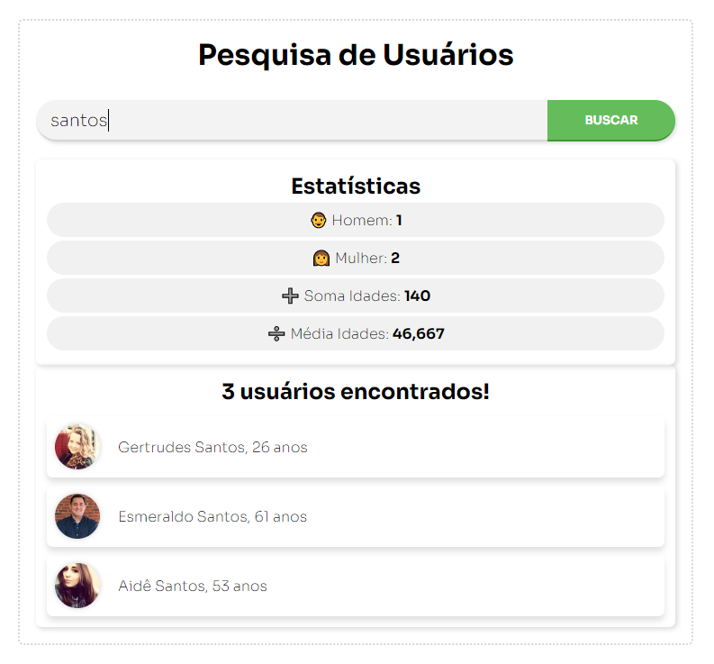

Projeto desenvolvido no Bootcamp do IGTI [Meu primeiro bootcamp]

### Objetivo

Exercitar a busca de dados numa API via Javascript.

### Tecnologias usadas

Javascript

### Projeto final do Módulo 1 do bootcamp da IGTI

<a href="https://pedropaulodf.netlify.app/modulo1/desafio-final-modulo-1/" target="_blank">Veja ele no Netlify</a>

